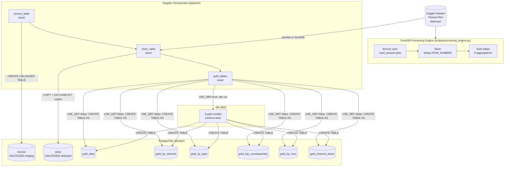
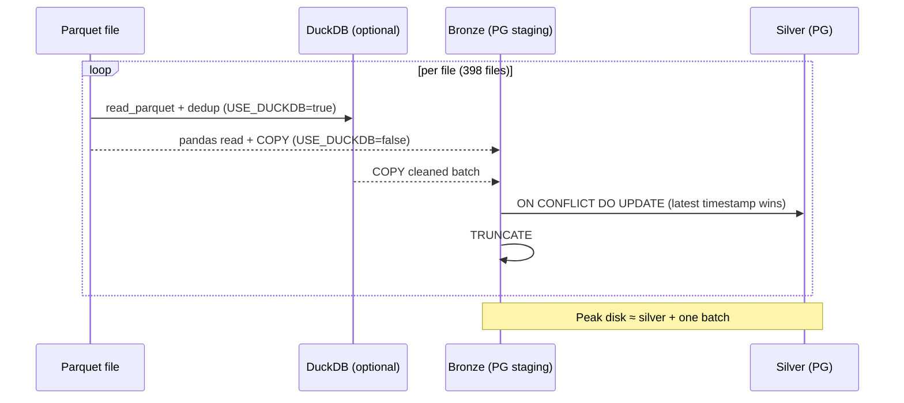

# BGD — Medallion ELT Pipeline

This project implements a medallion architecture (Bronze → Silver → Gold) ELT pipeline on a transactional dataset. It uses **PostgreSQL** as the data store, **DuckDB** as a scalable in-process processing engine, **Dagster** for orchestration, and **dbt** for gold-layer transformations.

## Deliverables

- **Problem Statement**: `docs/report.md`
- **DB Architecture (ERD + High Level)**: embedded below in Mermaid
- **Reproducible SQL script**: `sql/elt_pipeline.sql`
- **Code (versioned)**: `src/`, `pipeline/`, `dbt/`, `scripts/`
- **Data Quality Risks**: documented in `docs/report.md`

## Project Structure

```
BGD/
├── src/                        # Core ELT modules
│   ├── main.py                 # End-to-end orchestration (Python)
│   ├── bronze.py               # Bronze layer
│   ├── silver.py               # Silver layer (pandas or DuckDB path)
│   ├── gold.py                 # Gold layer (SQL)
│   ├── config.py               # Pydantic Settings (reads .env)
│   ├── sql_queries.py          # Named SQL loader
│   └── utils/
│       ├── db.py               # PostgreSQL connection manager
│       ├── duckdb_client.py    # DuckDB connection manager
│       └── constants.py        # Table names, column lists
├── pipeline/                   # Dagster orchestration
│   ├── definitions.py          # Dagster Definitions (assets, job, resources)
│   ├── assets/                 # bronze_table, silver_table, gold_tables
│   └── resources/              # PostgresResource, DuckDBResource
├── dbt/                        # dbt gold-layer transformations
│   ├── dbt_project.yml
│   ├── profiles.yml            # connection from env vars
│   └── models/marts/           # 6 gold models + schema tests
├── scripts/
│   └── processing_engine.py   # Standalone DuckDB engine (no PostgreSQL needed)
├── sql/
│   ├── elt_queries.sql         # All DDL + named queries
│   └── elt_pipeline.sql
├── docs/
│   └── report.md
├── .env.example                # Environment variable template
└── docker-compose.yml          # PostgreSQL 15
```

## Architecture Diagrams (Mermaid)

### ERD (Medallion Tables)


### High-Level Architecture



### Data Flow (Silver Streaming)



## Requirements

- Docker + Docker Compose
- Python 3.10+
- `uv` package manager

## Setup

1. Start PostgreSQL:

```
docker compose up -d
```

2. Install dependencies:

```
uv sync
```

## Run the pipeline

```
uv run python -m src.main
```

This will:

- download/prepare dataset (if missing),
- load Bronze (UNLOGGED — no WAL overhead),
- clean Silver (UNLOGGED) by streaming each parquet file through Bronze staging (load -> upsert -> truncate),
- build Gold tables.

> **Storage note:** Bronze is a transient staging table used per batch during
> Silver build. Each file is loaded into Bronze, upserted into Silver, then
> Bronze is truncated. This keeps peak usage close to `silver + one batch`.

## Non-destructive run options

`src/silver` recreates both `silver` and `bronze` as part of its own run.
If you only want to rebuild Gold from an existing Silver table, run:

```
uv run python -m src.gold
```

To rebuild Silver from raw parquet files:

```
uv run python -m src.silver
```

You can also run specific layers independently:

```
uv run python -m src.bronze
uv run python -m src.silver
uv run python -m src.gold
```

## Runnable scripts (ordered)

All scripts below include a `if __name__ == "__main__":` entry point and can be executed directly:

1. `src/bronze.py` — create the Bronze staging schema (UNLOGGED, empty)
2. `src/silver.py` — stream raw parquet through Bronze staging and upsert cleaned data into Silver
3. `src/gold.py` — build Gold tables (aggregations + JOIN-based)
4. `src/sql_queries.py` — list available SQL query names
5. `src/main.py` — end-to-end orchestration

## Data Quality Risks

1. Duplicate transactions (same `transaction_id`)
2. Null/empty keys
3. Timestamp formatting inconsistencies

Full details: [docs/report.md](docs/report.md).