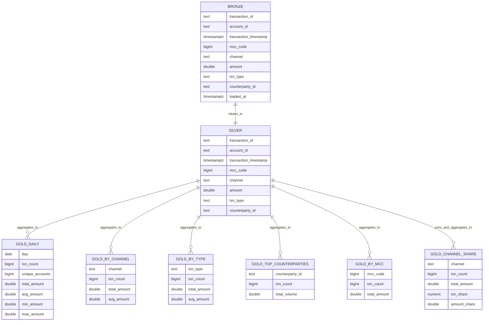
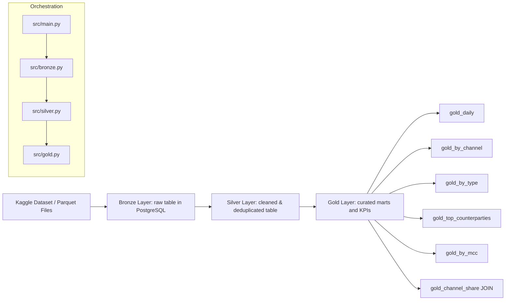

# BGD — Medallion ELT Pipeline (PostgreSQL)

This project implements a medallion architecture (Bronze → Silver → Gold) ELT pipeline on a transactional dataset. It includes reproducible SQL, Python loaders, and documentation with architecture diagrams.

## Deliverables

- **Problem Statement**: `docs/report.md`
- **DB Architecture (ERD + High Level)**: embedded below in Mermaid
- **Reproducible SQL script**: `sql/elt_pipeline.sql`
- **Code (versioned)**: `src/`
- **Data Quality Risks**: documented in `docs/report.md`

## Project Structure

```
BGD/
├── sql/
│   ├── elt_queries.sql
│   └── elt_pipeline.sql
├── src/
│   ├── bronze.py
│   ├── silver.py
│   ├── gold.py
│   ├── main.py
│   └── sql_queries.py
├── docs/
│   ├── report.md
│   └── diagrams/
│       ├── erd.drawio
│       └── architecture.drawio
└── docker-compose.yml
```

## Architecture Diagrams (Mermaid)

### ERD (Medallion Tables)



### High-Level Architecture



## Requirements

- Docker + Docker Compose
- Python 3.10+
- `uv` (recommended) or standard venv + pip

## Setup

1. Start PostgreSQL:

```
docker compose up -d
```

2. Install dependencies:

```
uv sync
```

## Run the pipeline

```
uv run python -m src.main
```

This will:

- download/prepare dataset (if missing),
- load Bronze (UNLOGGED — no WAL overhead),
- clean Silver (UNLOGGED) by streaming each parquet file through Bronze staging (load → upsert → truncate),
- build Gold tables.

> **Storage note:** Bronze is a transient staging table used per batch during
> Silver build. Each file is loaded into Bronze, upserted into Silver, then
> Bronze is truncated. This keeps peak usage close to `silver + one batch`.

## Non-destructive run options

`src/silver` recreates both `silver` and `bronze` (staging) as part of its own
run. If you only want to rebuild Gold from an existing Silver table, run:

```
uv run python -m src.gold
```

To rebuild Silver from raw parquet files:

```
uv run python -m src.silver   # streams parquet → bronze staging → silver
```

You can also run specific layers independently:

```
uv run python -m src.bronze
uv run python -m src.silver
uv run python -m src.gold
```

## Runnable scripts (ordered)

All scripts below include a `if __name__ == "__main__":` entry point and can be executed directly:

1. `src/bronze.py` — create the Bronze staging schema (UNLOGGED, empty)
2. `src/silver.py` — stream raw parquet through Bronze staging and upsert cleaned data into Silver
3. `src/gold.py` — build Gold tables (aggregations + JOIN-based)
4. `src/sql_queries.py` — list available SQL query names
5. `src/main.py` — end-to-end orchestration

## SQL-Only Reproducible Pipeline

If you want to re-run the pipeline purely via SQL (tables only):

```
psql -h localhost -U user -d bigdata -f sql/elt_pipeline.sql
```

## Data Quality Risks (summary)

1. Duplicate transactions (same `transaction_id`)
2. Null/empty keys
3. Timestamp formatting inconsistencies

Full details: `docs/report.md`.

## Operational note: storage-efficient design

Both Bronze and Silver are created as **`UNLOGGED TABLE`** in PostgreSQL.
This means:

- No WAL (write-ahead log) is written during inserts → roughly **2× less disk
  I/O** during the load phase.
- `VACUUM` is a no-op on UNLOGGED tables; `ANALYZE` is run on Silver after the
  streaming upsert phase so the query planner has accurate statistics.
- Bronze is used as an ephemeral per-batch staging table and truncated between
  batches; it is retained empty at the end to keep the raw-layer schema visible.
